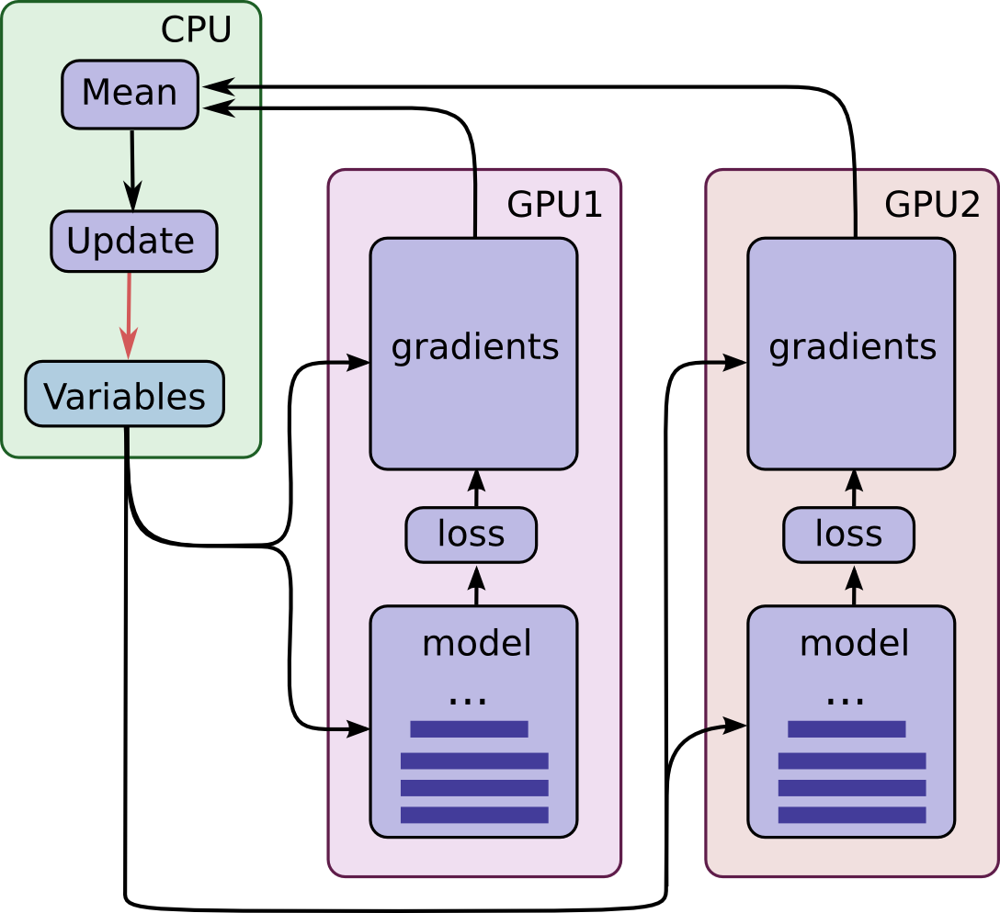

# MutiltGPU_Unet2d
> This is an examples of how to use mutilGPU training

## How to Use
当我们想用多块GPU来进行模型训练时，我们可以用Tensorflow很简单的实现。 
我以细胞分割为例，具体实现步骤 
1、数据集下载：链接: https://pan.baidu.com/s/1T0hKE0uvWkDHnK-a8p1bGg 密码: g1u4 
2、将下好的数据集放在D:\Data\目录下 
3、将ceil_image.csv和ceil_mask.csv跟MutiltGPU_Unet2d_ceil_train.py放在同一目录下 
4、修改batch_size 和num_gpus参数即可

## Contact
* https://github.com/junqiangchen
* email: 1207173174@qq.com
* WeChat Public number: 最新医学影像技术
